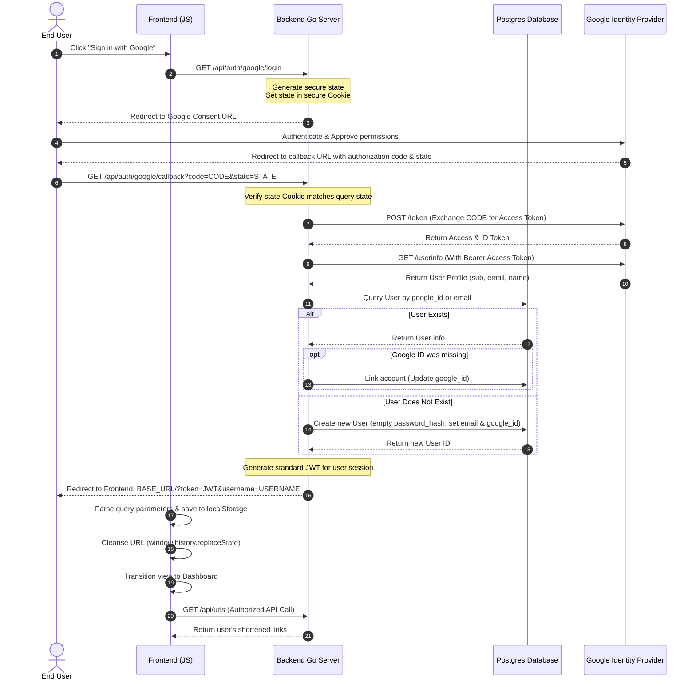

# Product Requirements Document (PRD)
## Google OAuth 2.0 Integration for Snip URL Shortener

---

## 1. Document Overview

### 1.1 Purpose
This document outlines the product and technical requirements for integrating Google OAuth 2.0 authentication into the **Snip** URL Shortener application. The goal is to provide users with a secure, one-click sign-in and registration experience, streamlining user onboarding and retention.

### 1.2 Status
* **Author:** Antigravity (AI Coding Assistant)
* **Date:** May 26, 2026
* **Version:** 1.0 (Draft)
* **Target Release:** Q2 2026

---

## 2. Executive Summary & Problem Statement

### 2.1 The Problem
Currently, the Snip URL Shortener requires users to register and log in using a manual username and password combination. Modern web application users expect rapid, single-click authentication methods (social sign-in) that do not require managing another set of unique credentials. This password barrier increases friction during onboarding, reducing user engagement and shortcode creation rates.

### 2.2 The Solution
Integrating **Google OAuth 2.0** allows users to authenticate seamlessly using their existing Google accounts. This will:
1. **Reduce Friction:** Eliminate the username/password entry forms for Google users.
2. **Increase Trust:** Delegate credential management to Google's highly secure identity service.
3. **Account Unification:** Support linking existing username/password accounts with Google logins when emails match, preserving their shortened links and analytics history.

---

## 3. Goals & Scope

### 3.1 Goals
* Allow new users to sign up and instantly get an account via Google Auth.
* Allow existing users to log in instantly using their Google account.
* Auto-link accounts if a user with a matching email already exists, preventing duplicates.
* Retain the existing custom username/password registration and login option.
* Implement a robust state-validation mechanism to prevent Cross-Site Request Forgery (CSRF) during the OAuth flow.
* Securely transmit and store the authentication token (JWT) on the client.

### 3.2 Non-Goals
* Support for other social login providers (GitHub, Apple, Facebook) at this time (designed to be easily extensible in the future).
* Full profile synchronization (e.g., syncing user avatars, though we will retrieve email and display names during auth).
* OAuth 2.0 provider capabilities (i.e., making Snip an identity provider itself).

---

## 4. User Experience & Interfaces (UX/UI)

### 4.1 Login / Signup Component
* A new "**Sign in with Google**" button will be added to the auth card below the primary Log In/Sign Up buttons.
* The button must comply with Google's branding guidelines (using the official Google logo, correct spacing, white/gray color styling, and standard typography).
* Visually, there will be an "Or" divider separating the traditional form and the Google login option.

```
+------------------------------------------+
|               Welcome Back               |
|   Login to access your personal links    |
+------------------------------------------+
|  [Username]                              |
|  [Password]                              |
|                                          |
|  +------------------------------------+  |
|  |              Log In                |  |
|  +------------------------------------+  |
|                                          |
|                - OR -                    |
|                                          |
|  +------------------------------------+  |
|  |       G  Sign in with Google       |  |
|  +------------------------------------+  |
|                                          |
|       Need an account? Sign up           |
+------------------------------------------+
```

### 4.2 Authentication Redirect Flow
1. User clicks **"Sign in with Google"**.
2. The UI redirects the user (or opens a window/popup) to the backend endpoint `/api/auth/google/login`.
3. The backend generates a secure `state` parameter, sets it as an encrypted/hashed cookie, and redirects the user to Google's authorization consent page.
4. User completes authorization on Google's domain.
5. Google redirects the user back to the backend callback endpoint `/api/auth/google/callback?code=...&state=...`.
6. The backend validates the `state`, exchanges the `code` for user credentials, registers/logs in the user in the database, and generates a standard JWT.
7. The backend redirects the user back to the frontend homepage with the token as query parameters: `http://localhost:8080/?token=JWT_TOKEN&username=USERNAME`.
8. The frontend parses the URL parameters, stores the token in `localStorage`, clears the parameters from the URL history (via `window.history.replaceState`), and updates the UI state.

---

## 5. Functional & Technical Requirements

### 5.1 Frontend (Web client)
* **Requirement 1:** Display the branded Google login button in the auth card.
* **Requirement 2:** Redirect to the Go backend's `/api/auth/google/login` route when the Google login button is clicked.
* **Requirement 3:** Parse query parameters on load (`token` and `username`) on the index page.
* **Requirement 4:** Save credentials to `localStorage` and transition the interface to the authenticated state (showing shortened links and history).
* **Requirement 5:** Cleanse the URL parameters dynamically after consumption to maintain a clean UI and prevent token exposure in bookmarks or history.

### 5.2 Backend (Go API server)
* **Requirement 1:** Define Google OAuth 2.0 configuration options in the system config and `.env` template:
  - `GOOGLE_CLIENT_ID`
  - `GOOGLE_CLIENT_SECRET`
  - `GOOGLE_REDIRECT_URL` (the backend callback endpoint, e.g., `http://localhost:8080/api/auth/google/callback`)
* **Requirement 2:** Expose GET `/api/auth/google/login`:
  - Generate a cryptographically secure random `state` string.
  - Set the `state` in an HTTP-only, secure, short-lived cookie.
  - Redirect the user to Google's authorization URL with parameters: `client_id`, `redirect_uri`, `response_type=code`, `scope=openid email profile`, and the generated `state`.
* **Requirement 3:** Expose GET `/api/auth/google/callback`:
  - Verify that the `state` query parameter matches the cookie state.
  - Exchange the `code` for an OAuth token by calling Google's token API (`https://oauth2.googleapis.com/token`).
  - Retrieve the user profile from Google's UserInfo API (`https://www.googleapis.com/oauth2/v3/userinfo`) using the retrieved access token.
  - Perform user matching and creation in the repository:
    - Search for an existing user with `google_id` equal to Google's profile `sub` ID.
    - If not found, search for an existing user with `email` equal to Google's profile `email`.
    - If found by email but missing `google_id`, update the user's `google_id` (linking the account).
    - If not found at all, create a new user record:
      - `username`: Email prefix or name. If conflict arises, append a unique identifier (e.g. part of their Google ID).
      - `email`: User's Google email.
      - `google_id`: User's Google sub ID.
      - `password_hash`: Empty/NULL (as they don't have a local password).
  - Generate a secure JWT token for the user.
  - Clear the state cookie.
  - Redirect the browser to `BASE_URL` with query parameters `?token=...&username=...`.

### 5.3 Database & Migrations
* **Requirement 1:** Update the `users` table schema:
  - Add `email VARCHAR(255) UNIQUE` (optional/nullable to accommodate legacy users, but populated for Google users).
  - Add `google_id VARCHAR(255) UNIQUE` (nullable, only populated for Google-linked accounts).
  - Make `password_hash` column nullable (`DROP NOT NULL`) to allow passwordless OAuth users.
* **Requirement 2:** Maintain full backward compatibility for users created via the manual username/password flow.

---

## 6. Technical Flow & Architecture

### 6.1 Authentication Sequence Diagram



---

## 7. Security Considerations

* **State Token Validation:** A cryptographically secure random `state` token is generated for every request. This prevents Cross-Site Request Forgery (CSRF) by ensuring that the callback request originated from the user's authentic login attempt.
* **HTTPS/TLS:** In production environments, all redirects, cookies, and tokens must use secure HTTPS. The state cookie will have the `Secure` flag enabled in production.
* **Cookie Attributes:** The `state` cookie must be `HttpOnly`, `Path=/`, and use `SameSite=Lax` to prevent cross-site leakage while allowing oauth redirect ingestion.
* **Password Hashing:** Manual passwords remain encrypted via bcrypt. Google accounts will have an empty password hash field, blocking password-based logins unless they explicitly trigger a password reset (future enhancement).

---

## 8. Success Metrics
* **OAuth Adoption Rate:** > 40% of new user sign-ups utilize Google OAuth 2.0 within 30 days of release.
* **Registration Conversion:** A 15% reduction in drop-offs on the login/signup card.
* **Zero Security Violations:** No successful CSRF or session-fixation exploits reported in auth logs.
